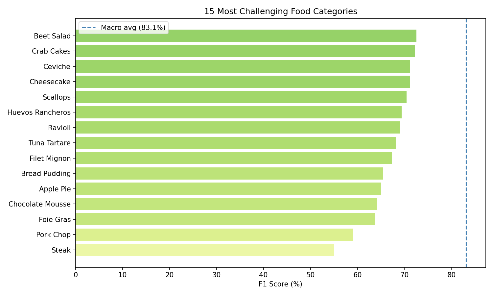
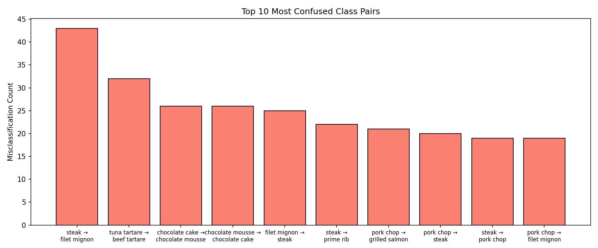

# Food Vision — 101-Class Food Image Classifier

A deep learning project that classifies food images across **101 categories** using transfer learning with EfficientNetB2, trained on the Food101 dataset. The model outperforms two published academic baselines.

---

## Results

| Model | Top-1 Accuracy |
|---|---|
| Food101 Paper — Bossard et al. (2014) | 50.5% |
| DeepFood — Liu et al. (2016) | 77.4% |
| **This model (EfficientNetB2)** | **83.2%** |

**F1 Score (Macro):** 83.13%  
**F1 Score (Weighted):** 83.13%  
**vs DeepFood baseline:** +5.83%



---

## Approach

### Part 1 — Baseline CNN (from scratch)
Built a custom convolutional neural network trained from random weights on a binary pizza vs. steak classification task. Served as the baseline to understand the gap that transfer learning closes.

### Part 2 — Transfer Learning with EfficientNetB2
Scaled to the full 101-class Food101 dataset using a two-phase transfer learning strategy:

**Phase 1 — Feature Extraction (5 epochs)**  
EfficientNetB2 pretrained on ImageNet is frozen. Only the custom classification head is trained. Val accuracy reached 83% before fine-tuning began.

**Phase 2 — Fine-Tuning (top 30 layers unfrozen)**  
The top 30 layers of EfficientNetB2 are unfrozen and allowed to adapt to food-specific visual patterns using a low learning rate (5e-5) to avoid overwriting pretrained ImageNet knowledge.

---

## Architecture

```
Input (260×260×3)
    → EfficientNet built-in preprocessing
    → EfficientNetB2 backbone (ImageNet pretrained)
    → GlobalAveragePooling2D
    → BatchNormalization
    → Dropout(0.4)
    → Dense(512, relu)
    → Dropout(0.3)
    → Dense(101, softmax, float32)
```

**Key design decisions:**
- **EfficientNetB2** over B0 — higher capacity, native 260px input better matches Food101 image quality
- **GlobalAveragePooling** instead of Flatten — reduces parameters, less overfitting
- **BatchNormalization** — stabilizes training during fine-tuning where pretrained weights are sensitive
- **AdamW + Cosine Decay LR** — weight decay acts as regularization; cosine schedule gives smoother convergence than fixed LR
- **Mixed Precision (float16)** — faster training on GPU, final Dense layer kept at float32 for numerical stability
- **output dtype=float32** — required with mixed precision to keep softmax stable across 101 classes

---

## Training Configuration

```python
IMG_SIZE   = 260       # EfficientNetB2 native resolution
BATCH_SIZE = 32
OPTIMIZER  = AdamW

# Phase 1
LR         = CosineDecay(initial=1e-3, decay_steps=STEPS * 5)
EPOCHS     = 5

# Phase 2
LR         = CosineDecay(initial=5e-5, decay_steps=STEPS * 10)
EPOCHS     = 15 (early stopping, patience=3)
```

**Data augmentation (applied during training only):**
- Random horizontal flip
- Random brightness (±15%)
- Random contrast (0.8–1.2×)
- Random saturation (0.8–1.2×)
- Random crop after padding (+20px)

---

## Error Analysis

**Most challenging categories** (lowest F1): Steak (55%), Pork Chop (60%), Foie Gras (64%)

**Most confused pairs:**
- Steak → Filet Mignon (43 errors) — semantically and visually similar beef cuts
- Tuna Tartare → Beef Tartare (32 errors) — similar preparation and presentation
- Chocolate Cake ↔ Chocolate Mousse (26 errors each) — similar colour and texture

These confusions reflect genuine visual ambiguity rather than model failure — the same dishes would challenge human classifiers without context.

---

## Dataset

**Food101** — 101 food categories, 101,000 images total  
- 75,750 training images  
- 25,250 test images  
- Source: [tensorflow_datasets](https://www.tensorflow.org/datasets/catalog/food101)

---

## Environment

- Python 3.10
- TensorFlow 2.x
- Kaggle Notebooks (Tesla P100 16GB GPU)
- Mixed Precision: float16

---

## Files

| File | Description |
|---|---|
| `Convolution_pizza_steak.ipynb` | Full notebook — Part 1 (baseline CNN) + Part 2 (transfer learning) |
| `README.md` | This file |

---

## References

- Bossard et al. (2014) — [Food-101: Mining Discriminative Components with Random Forests](https://link.springer.com/chapter/10.1007/978-3-319-10599-4_29)
- Liu et al. (2016) — [DeepFood: Deep Learning-Based Food Image Recognition for Computer-Aided Dietary Assessment](https://link.springer.com/chapter/10.1007/978-3-319-42291-6_1)
- Tan & Le (2019) — [EfficientNet: Rethinking Model Scaling for Convolutional Neural Networks](https://arxiv.org/abs/1905.11946)
